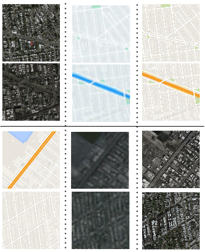
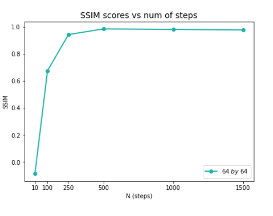

# Paired-Via-Sde

We implement a Score-based Generative Model to perform paired image-to-image translations from an image domain A to an image domain B and vice versa. 
Domain A consists of satellite images. Domain B consists of the corresponding maps style images. 

### Results:
|1st column: Input Images / 2nd column: Ours (generated by conditional samplers) / 3rd column: Actual |
|:---:|
||

We calculated the Structural Similarity Index Measure(SSIM) between the generated and actual images. With 1500 sampling steps the SSIM was calculated to be 0.977 showing that our model generated images very similar to the actual ground truth. The SSIM score as a function of the number of sampling steps is depicted in the figure below

|SSIM vs Number of Sampling Steps|
|:---:|
||

### Dataset
The model was trained on the Maps dataset [link](http://efrosgans.eecs.berkeley.edu/pix2pix/datasets/).

### Training
To set the parameters edit the config.py file and then run the code as given in the main.ipynb notebook file.

